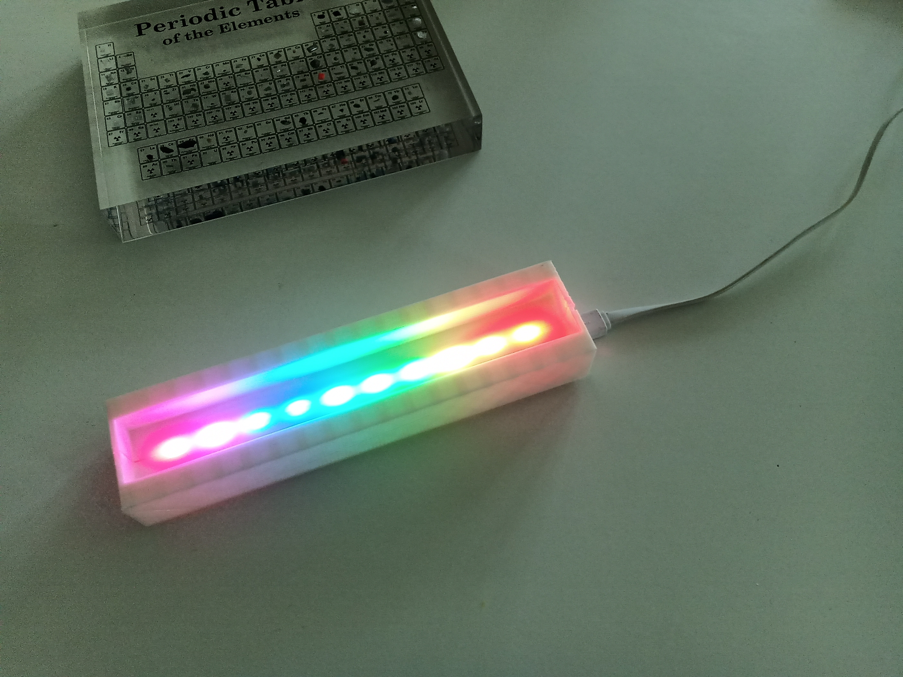
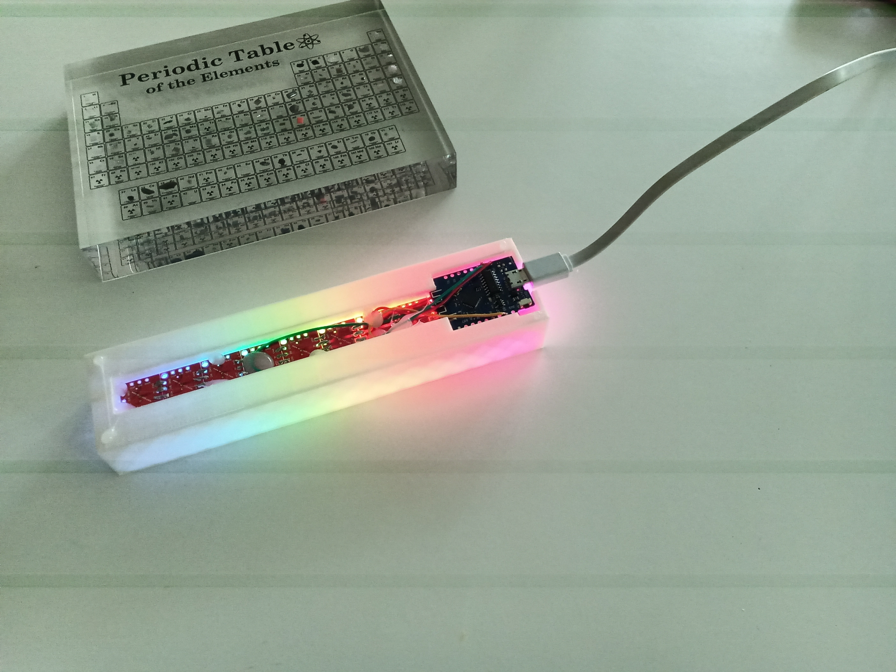
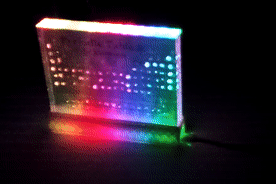
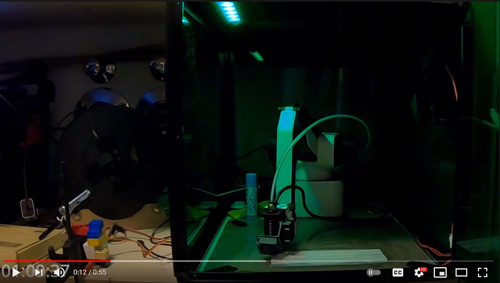

# PeriodicTabLED
I got my wife a periodic table with real elements sandwiched between two pieces of acrylic glass.

I decided it would look even better with a stand with built-in RGB-LED.
So I've taken some things and software I've lying around or had experience with
* Wemos D1 Mini Lite
* WS2812S LEDs 
* Rotrics DexArm Robot
* Arduino IDE
* 3D Builder
* Blender
* solder wire 
and done it;)
I took this also as an opportunity to experience my first designing and 3d-printing since I've everything at home for it.

3D printing TimeLapse

